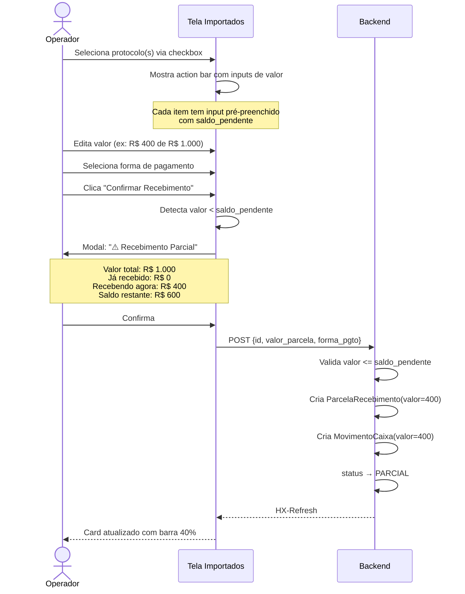
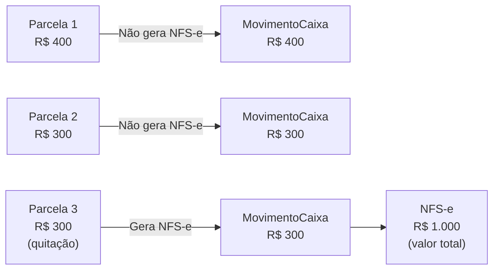

# Recebimento Parcial por Protocolo

Permitir que um protocolo importado seja recebido em múltiplas parcelas, com valores e formas de pagamento diferentes, mantendo rastreabilidade completa. NFS-e gerada somente na quitação total.

---

## Decisões Definidas

| # | Questão | Decisão |
|---|---------|---------|
| D1 | Taxas na parcela | **Não** — pagamento parcial é em cima do valor total. Taxas ficam no `MovimentoImportado` original, não são divididas por parcela |
| D2 | NFS-e quando? | **Só na quitação** — valor total do protocolo |
| D3 | Forma pagamento por parcela? | **Sim** — cada parcela pode ter forma diferente (PIX, dinheiro, etc.) |
| D4 | Cross-caixa? | **Sim** — pendente pertence ao **tenant**, aparece em qualquer caixa da empresa |
| D5 | Prazo de quitação? | **Sim** — configurável + notificações diárias de vencimento |
| D6 | Onde mostrar pendentes? | **Dashboard** (widget) + **Relatório** dedicado |

---

## Fluxo Geral

```mermaid
flowchart TD
    A["SQL → MovimentoImportado"] --> B["Operador seleciona protocolo"]
    B --> C["Input: valor a receber (pré-preenchido com saldo_pendente)"]
    C --> D{"valor < saldo_pendente?"}
    D -->|Sim| E["Modal: ⚠️ Recebimento Parcial<br/>Mostra valor total, recebendo, restante"]
    D -->|Não (=)| F["Confirmação normal"]
    E --> G["Cria ParcelaRecebimento + MovimentoCaixa"]
    F --> G
    G --> H{"Quitou? saldo == 0"}
    H -->|Sim| I["status = QUITADO<br/>confirmado = True<br/>Gera NFS-e"]
    H -->|Não| J["status = PARCIAL<br/>Permanece na lista"]
    J --> K["Caixa fecha normalmente"]
    K --> L["Próxima abertura (qualquer caixa)<br/>Pendentes migram automaticamente"]
    L --> B
```

---

## Modelo de Dados

### Novo: `ParcelaRecebimento`

```python
class StatusRecebimento(models.TextChoices):
    PENDENTE = "PENDENTE", "Pendente"
    PARCIAL = "PARCIAL", "Parcial"
    QUITADO = "QUITADO", "Quitado"
    VENCIDO = "VENCIDO", "Vencido"

class ParcelaRecebimento(TenantAwareModel):
    movimento_importado = FK(MovimentoImportado, related_name="parcelas")
    movimento_caixa = FK(MovimentoCaixa)          # destino no caixa
    abertura = FK(AberturaCaixa)                   # em qual sessão foi recebida
    forma_pagamento = FK(FormaPagamento)
    valor = DecimalField(max_digits=14, decimal_places=2)
    numero_parcela = PositiveIntegerField()        # 1, 2, 3...
    recebido_por = FK(User)
    recebido_em = DateTimeField(auto_now_add=True)
    observacao = TextField(blank=True)
```

### Alterações no `MovimentoImportado`

```python
# Novos campos
status_recebimento = CharField(
    choices=StatusRecebimento.choices,
    default=StatusRecebimento.PENDENTE
)
prazo_quitacao = DateField(null=True, blank=True)  # prazo limite

# Properties (sem campo no banco)
@property
def valor_recebido(self) -> Decimal:
    return self.parcelas.aggregate(t=Sum("valor"))["t"] or Decimal("0.00")

@property
def saldo_pendente(self) -> Decimal:
    return self.valor - self.valor_recebido

@property
def percentual_recebido(self) -> int:
    if not self.valor: return 0
    return int((self.valor_recebido / self.valor) * 100)

@property
def prazo_vencido(self) -> bool:
    if not self.prazo_quitacao: return False
    return date.today() > self.prazo_quitacao and self.status_recebimento != "QUITADO"
```

### ER Diagram

```mermaid
erDiagram
    MovimentoImportado ||--o{ ParcelaRecebimento : "parcelas"
    ParcelaRecebimento ||--|| MovimentoCaixa : "gera"
    ParcelaRecebimento }o--|| FormaPagamento : "forma"
    ParcelaRecebimento }o--|| AberturaCaixa : "sessão"
    MovimentoCaixa ||--o| NotaFiscalServico : "só na quitação"
    
    MovimentoImportado {
        decimal valor "valor total protocolo"
        string status_recebimento "PENDENTE PARCIAL QUITADO VENCIDO"
        date prazo_quitacao "prazo limite"
        string protocolo "identificador"
    }
    
    ParcelaRecebimento {
        fk movimento_importado FK
        fk movimento_caixa FK
        fk forma_pagamento FK
        fk abertura FK
        decimal valor "valor desta parcela"
        int numero_parcela "sequencial"
        fk recebido_por FK
        datetime recebido_em
    }
```

---

## Continuidade Entre Sessões (Cross-Caixa)

> O pendente pertence ao **tenant**, não ao caixa específico.

### Migração automática na abertura

Quando qualquer caixa é aberto (`AbrirCaixaView`), o sistema busca pendentes do tenant inteiro:

```python
def migrar_pendentes_para_nova_abertura(nova_abertura):
    """Re-vincula importados PARCIAL/PENDENTE de qualquer caixa fechado."""
    pendentes = MovimentoImportado.objects.filter(
        tenant=nova_abertura.tenant,
        abertura__fechado=True,                         # abertura anterior já fechou
        status_recebimento__in=["PENDENTE", "PARCIAL"],
    )
    pendentes.update(abertura=nova_abertura)
```

### Na tela de importados — agrupamento

```
┌─ ⚠️ Pendentes de Sessões Anteriores (2 protocolos) ──────┐
│                                                            │
│  🟠 PARCIAL  Protocolo 12345  —  R$ 600,00 restante      │
│     Origem: CAIXA-01 em 10/02 │ 1 parcela recebida       │
│     ████████░░░░░░░░ 40%  │  Prazo: 15/02 (3 dias)       │
│                                                            │
│  🟡 PENDENTE Protocolo 67890  —  R$ 350,00 total         │
│     Origem: CAIXA-02 em 09/02 │ Prazo: 12/02 ⚠️ VENCIDO │
│                                                            │
└─ [Selecionar] [Valor] [Forma Pgto ▼] [Confirmar] ────────┘

┌─ Importados Desta Sessão (5 protocolos) ──────────────────┐
│  ...lista normal dos recém-importados...                   │
└────────────────────────────────────────────────────────────┘
```

### No fechamento de caixa

Ao fechar, se há pendentes, mostra aviso (não bloqueia):

```
⚠️ Existem 2 protocolo(s) com saldo pendente de R$ 950,00.
Eles estarão disponíveis na próxima abertura de qualquer caixa.
```

---

## UX do Operador — Fluxo de Confirmação

### Passo a passo



### Modal de confirmação parcial

```
┌─ ⚠️ Recebimento Parcial ─────────────────────────────────┐
│                                                            │
│  Protocolo 12345 — Escritura de Compra e Venda             │
│                                                            │
│  Valor total do protocolo:  R$ 1.000,00                    │
│  Já recebido:               R$     0,00                    │
│  Recebendo agora:           R$   400,00  ← PIX            │
│  Saldo restante:            R$   600,00                    │
│                                                            │
│  Prazo de quitação: [___15/02/2026___] (opcional)          │
│                                                            │
│  O saldo restante ficará pendente e aparecerá              │
│  na próxima abertura de qualquer caixa.                    │
│                                                            │
│  [Cancelar]                    [Confirmar Recebimento]     │
└────────────────────────────────────────────────────────────┘
```

---

## NFS-e — Somente na Quitação



**Na `confirmar_movimentos`:**
- Parcela intermediária: cria `MovimentoCaixa` sem disparar NFS-e
- Parcela de quitação: cria `MovimentoCaixa` + dispara NFS-e com `valor_servicos = valor_total_protocolo`

**Na `criar_nfse_de_movimento`:**
- Detecta que é quitação via importação de origem
- Usa `valor_total` do `MovimentoImportado`, não o `valor` da parcela

---

## Recibo Detalhado — Impacto no Parcial

> O template [recibo_detalhado.html](file:///c:/Users/Rodrigo/Projetos/wCaixaDigital/templates/caixa/recibo_detalhado.html) **já possui** os campos `Total`, `Total Pago` e `Valor a Receber`. A view [ReciboDetalhadoView](file:///c:/Users/Rodrigo/Projetos/wCaixaDigital/caixa_nfse/caixa/views.py#L955-L1046) calcula via `importacao_origem`. Precisa apenas expandir para parciais.

### O que muda na view `ReciboDetalhadoView`

```python
# Hoje:
ctx["total_pago"] = movimento.valor        # valor deste movimento
ctx["valor_a_receber"] = total_ato - total_pago

# Depois:
importado = movimento.importacao_origem.first()
if importado and importado.status_recebimento in ("PARCIAL", "QUITADO"):
    ctx["total_pago"] = importado.valor_recebido     # soma de TODAS as parcelas
    ctx["valor_a_receber"] = importado.saldo_pendente
    ctx["parcelas"] = importado.parcelas.order_by("numero_parcela")
    ctx["is_parcial"] = True
    ctx["numero_parcela"] = parcela_atual.numero_parcela
    ctx["total_parcelas"] = importado.parcelas.count()
else:
    ctx["total_pago"] = movimento.valor
    ctx["valor_a_receber"] = total_ato - total_pago
```

### Layout do recibo quando for parcial

```
┌──────────────────────────────────────────────────────────┐
│                   RECIBO DETALHADO                        │
│                   Cartório 1                              │
├──────────────────────────────────────────────────────────┤
│  Protocolo: 12345              Data: 12/02/2026 14:30    │
│  Tipo: Entrada                 Pagamento: PIX            │
│  Caixa: CAIXA-01               ⚠️ PARCELA 2 de 3         │
├──────────────────────────────────────────────────────────┤
│  # │ Descrição do Ato      │ Emolum. │ ISS   │ Total    │
│  1 │ Escritura C&V          │ 800,00  │ 40,00 │ 900,00  │
│  2 │ Reconhecimento Firma   │  80,00  │  4,00 │  100,00 │
│    │                   TOTAIS│ 880,00  │ 44,00 │1.000,00 │
├──────────────────────────────────────────────────────────┤
│                                                          │
│  ┌─ Histórico de Parcelas ────────────────────────────┐  │
│  │  Parc. │ Data       │ Valor    │ Forma  │ Operador │  │
│  │  1ª    │ 10/02/2026 │  400,00  │ PIX    │ João     │  │
│  │  2ª    │ 12/02/2026 │  300,00  │ Dinh.  │ Maria    │  │
│  │  3ª    │ pendente   │  300,00  │  —     │  —       │  │
│  └────────────────────────────────────────────────────┘  │
│                                                          │
│  ┌────────────────────────────────────────────────────┐  │
│  │  Valor Total:        R$ 1.000,00                   │  │
│  │  Total Pago:         R$   700,00  ✅               │  │
│  │  Valor Restante:     R$   300,00  🔴               │  │
│  └────────────────────────────────────────────────────┘  │
│                                                          │
│     RECIBO VÁLIDO COMO COMPROVANTE DE PAGAMENTO          │
│                                                          │
│  Documento gerado em 12/02/2026 14:35 — Cartório 1      │
└──────────────────────────────────────────────────────────┘
```

### Arquivos afetados

| Arquivo | O que muda |
|---------|-----------|
| [ReciboDetalhadoView](file:///c:/Users/Rodrigo/Projetos/wCaixaDigital/caixa_nfse/caixa/views.py#L955) | Calcular `total_pago` via `parcelas`, injetar `parcelas` e `is_parcial` no context |
| [recibo_detalhado.html](file:///c:/Users/Rodrigo/Projetos/wCaixaDigital/templates/caixa/recibo_detalhado.html) | Adicionar badge "PARCELA X de Y", tabela de histórico de parcelas (condicional com ``) |

---

## Sistema de Notificações (NOVO)

> Não existe sistema de notificações hoje. Será criado um modelo genérico.

### Modelo `Notificacao`

```python
class TipoNotificacao(models.TextChoices):
    PROTOCOLO_VENCENDO = "PROTOCOLO_VENCENDO", "Protocolo vencendo"
    PROTOCOLO_VENCIDO = "PROTOCOLO_VENCIDO", "Protocolo vencido"
    FECHAMENTO_PENDENTE = "FECHAMENTO_PENDENTE", "Fechamento pendente"
    # extensível para outros tipos futuros

class Notificacao(TenantAwareModel):
    usuario = FK(User, related_name="notificacoes")
    tipo = CharField(choices=TipoNotificacao.choices)
    titulo = CharField(max_length=200)
    mensagem = TextField()
    lida = BooleanField(default=False)
    url = CharField(max_length=500, blank=True)  # link para a ação
    referencia_id = UUIDField(null=True)          # PK do objeto relacionado
```

### Geração diária (Celery beat / management command)

```python
# management/commands/verificar_prazos_protocolos.py
# Roda diariamente via cron ou celery-beat

def handle(self):
    hoje = date.today()
    
    # Protocolos vencendo nos próximos 3 dias
    vencendo = MovimentoImportado.objects.filter(
        status_recebimento__in=["PENDENTE", "PARCIAL"],
        prazo_quitacao__range=[hoje, hoje + timedelta(days=3)],
    )
    
    # Protocolos já vencidos
    vencidos = MovimentoImportado.objects.filter(
        status_recebimento__in=["PENDENTE", "PARCIAL"],
        prazo_quitacao__lt=hoje,
    )
    # → Cria Notificacao para gerentes do tenant
    # → Atualiza status para VENCIDO se prazo passou
```

### No header (base.html) — ícone de sino

```
┌─ 🔔 (3) ──────────────────────────┐
│ 🟡 Protocolo 12345 vencendo em 2d │
│ 🔴 Protocolo 67890 VENCIDO        │
│ 🔵 Fechamento pendente aprovação  │
│                                    │
│         [Ver todas]                │
└────────────────────────────────────┘
```

---

## Dashboard — Widget de Pendentes

### No dashboard admin (`dashboard_admin.html`)

Novo KPI card + mini-tabela:

```
┌─ KPIs existentes ─────────────────────────────────────────┐
│  💰 Vendas Hoje   📋 NFS-e Pendentes   🏦 Retenções      │
│  [novo] 📌 Protocolos Pendentes: 5 (R$ 3.200,00)         │
└────────────────────────────────────────────────────────────┘

┌─ 📌 Protocolos com Saldo Pendente ────────────────────────┐
│                                                            │
│  Prot.   │ Valor    │ Recebido │ Restante │ Prazo  │ Status│
│  12345   │ 1.000    │   400    │   600    │ 15/02  │ 🟠   │
│  67890   │   350    │     0    │   350    │ 12/02  │ 🔴   │
│  11111   │ 2.500    │ 1.500   │ 1.000    │   —    │ 🟠   │
│                                                            │
│  Total pendente: R$ 1.950,00                              │
│                                     [Ver Relatório →]     │
└────────────────────────────────────────────────────────────┘
```

### No `_get_admin_context`:

```python
# Protocolos pendentes
pendentes = MovimentoImportado.objects.filter(
    tenant=tenant, 
    status_recebimento__in=["PENDENTE", "PARCIAL", "VENCIDO"]
)
context["protocolos_pendentes"] = pendentes[:5]
context["total_pendente"] = pendentes.aggregate(...)
```

---

## Relatório Dedicado

### Nova view em `relatorios/`

**Relatório: Protocolos Pendentes de Recebimento**

| Filtros | Colunas | Exportação |
|---------|---------|------------|
| Status (PENDENTE/PARCIAL/VENCIDO) | Protocolo, Descrição, Valor Total | PDF |
| Período de importação | Recebido, Restante, % | XLSX |
| Prazo (vencido/no prazo/todos) | Parcelas (nº), Prazo, Status | |
| Caixa de origem | Última parcela em, Operador | |

---

## Arquivos Afetados — Resumo

| Arquivo | Operação | Esforço |
|---------|----------|---------|
| **caixa/models.py** | +`ParcelaRecebimento`, +`StatusRecebimento`, alter `MovimentoImportado` | Médio |
| **caixa/services/importador.py** | Refatorar `confirmar_movimentos` para parcial | Alto |
| **caixa/views.py** | `ConfirmarImportadosView` (valor parcial), `AbrirCaixaView` (migrar pendentes), `FecharCaixaView` (aviso), `ReciboDetalhadoView` (histórico parcelas) | Médio |
| **templates/caixa/partials/importados_list.html** | Input valor, agrupamento, modal | Alto |
| **templates/caixa/partials/_movimento_card.html** | Badge, barra progresso, mini-histórico | Médio |
| **templates/caixa/recibo_detalhado.html** | Badge "Parcela X/Y", tabela histórico de parcelas | Médio |
| **nfse/services.py** | `criar_nfse_de_movimento` usa valor total na quitação | Baixo |
| **core/models.py** | +`Notificacao`, +`TipoNotificacao` | Médio |
| **core/management/commands/verificar_prazos.py** | Comando de verificação diária | Baixo |
| **core/views.py** | `DashboardView._get_admin_context` + widget | Médio |
| **templates/core/dashboard_admin.html** | Widget de pendentes | Médio |
| **templates/base.html** | Ícone de sino + dropdown | Médio |
| **relatorios/views.py** | Nova view `ProtocolosPendentesView` | Médio |
| **relatorios/urls.py** | Nova URL | Baixo |
| **templates/relatorios/** | Template do relatório | Médio |
| **Migração** | Modelo + campo + data migration | Baixo |
| **Testes** | Parcial, quitação, cross-session, NFS-e, notificação, recibo | Alto |

---

## Fases de Implementação Sugeridas

| Fase | Escopo | Entregável |
|------|--------|-----------|
| **1. Core** | Modelo `ParcelaRecebimento` + `status_recebimento` + migração | Banco pronto |
| **2. Service** | Refatorar `confirmar_movimentos` + migração de pendentes na abertura | Lógica funcional |
| **3. UI** | Template importados (input valor, modal, badges, barra) | Operador funcional |
| **4. Recibo** | `ReciboDetalhadoView` + template com histórico de parcelas | Recibo correto |
| **5. NFS-e** | Ajustar `criar_nfse_de_movimento` para quitação | Nota fiscal correta |
| **6. Notificações** | Modelo `Notificacao` + comando diário + sino no header | Alertas ativos |
| **7. Dashboard + Relatório** | Widget admin + relatório "Protocolos Pendentes" | Visibilidade gerencial |
| **8. Testes** | Unit + integration para todo o fluxo | Cobertura |
